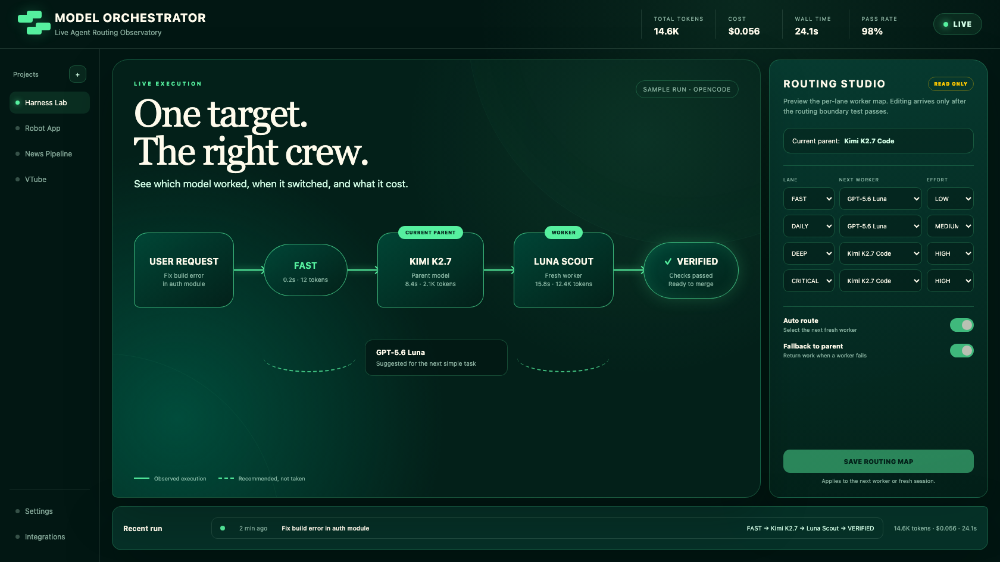

# Model Orchestrator

코딩 에이전트 런타임 다섯 개(Codex · Claude Code · OpenCode · OpenClaw · Hermes Agent)가 **같은 노력 정책** 하나를 쓰게 하는 라우터와, 하네스를 쓰이는 크기로 유지하는 작업 습관 모음입니다.

다섯 런타임을 오가며 프롬프트별 강도를 결정적으로 통일하고 싶을 때 쓰세요. 완전 자율 에이전트 프레임워크는 아닙니다.

프롬프트마다 **fast · daily · deep · critical** 네 차선 중 하나로 분류합니다. 분류기는 의존성 없는 Python 파일 하나이고, Codex·Claude Code에서는 셸 훅으로, OpenCode·OpenClaw·Hermes에서는 얇은 플러그인 뒤에서 같은 파일이 돕니다. 훅이 모델·추론 강도를 바꿀 수 있는 런타임에서는 차선을 **강제**할 수 있고, 아닌 곳에서는 라우팅 힌트만 넣고 그 사실을 숨기지 않습니다.

## 절감과 손해를 함께 측정한 결과

가장 먼저 볼 숫자입니다. 실험 2는 `opencode-go/gpt-5.6-luna`에서 같은 fast 과제 5개를 조건별 3회 실행했고, 비교한 모든 런이 숨은 검사를 통과했습니다. 음수는 사용량 감소입니다.

| 변경, 조건별 15런 | 통과율 | 입력+캐시 읽기 | 출력 | 추론 | 비용 |
|---|---:|---:|---:|---:|---:|
| 같은 하네스 `medium` → `low` | 15/15 → 15/15 | **-6.2%** | **-11.7%** | **-49.8%** | **-1.9%** |
| 라우터 없음 → `low` 강제 하네스 | 15/15 → 15/15 | **+17.7%** | **+15.4%** | **-34.7%** | **+3.8%** |

즉 low 변경은 이전 하네스 설정보다 나았지만, 이 작은 fast 과제에서는 라우터 없음보다 전체 사용량·비용이 줄지 않았습니다. 주입 문맥에도 비용이 있기 때문입니다. 원자료 75행·봉인된 결정 규칙·정확한 합계·한계는 [실험 2](bench/results/exp2-fastlane-20260908.md)에 있습니다. 추론 -49.8%를 청구액 50% 절감으로 홍보하면 안 됩니다.

## 왜

모든 프롬프트에 최대 추론을 쓰면 느리고 비싸고, 운영 마이그레이션에 최소 추론을 쓰면 사고가 납니다. 대부분은 설정 하나를 고른 뒤 잊습니다. Model Orchestrator는 프롬프트 단위로 결정합니다. 잘못된 입력·설정은 라우팅 출력 없이 끝나고, OpenCode·OpenClaw 어댑터는 분류를 2초로 제한해 라우터 실패가 턴을 막지 않게 합니다.

| 차선 | 신호 | 강도 | Codex 기본 | Claude 기본 |
|---|---|---|---|---|
| Fast | 짧은 조회·개수·정렬 | low | Luna / medium | Haiku / medium |
| Daily | 조사·검토·설명 | medium | Terra / medium | Sonnet / medium |
| Deep | 구현·리팩터·디버그·E2E | high | Sol / high | Sonnet / high |
| Critical | 보안·운영·결제·안전·반복 실패 | high | Astra / high | Opus / high |

안전 신호가 최우선입니다(`lane=fast audit security`도 Critical). 명시 요청(`lane=deep`, `effort-fast`)이 키워드보다 우선하고, 프로젝트 floor는 차선을 올릴 수만 있습니다.

강도 열은 프롬프트별 강제를 지원하는 런타임이 쓰는 값입니다. Codex·Claude 프로필은 자체 작업량
A/B 전까지 medium을 유지하며, 아래 low 결과는 OpenCode에서 측정했습니다.

## 런타임별로 실제로 바뀌는 것

프롬프트 훅은 실행 중인 세션의 모델을 몰래 바꾸지 못합니다. 검증 열은 런타임별로 확보한 가장 강한 증거이며, 한계도 [검증 문서](docs/evidence/VALIDATION.md)에 남깁니다.

| 런타임 | 훅 | 문맥 주입 | 프롬프트별 강도·모델 변경 | 검증 |
|---|---|---|---|---|
| Claude Code | `UserPromptSubmit` 셸 훅 | 예 | 아니오 — 차선별 서브에이전트·프로필 제공 | 훅 계약·설치기·격리된 로컬 마켓 설치 |
| Codex | `UserPromptSubmit` 셸 훅 | 예 | 아니오 — 다음 세션용 `codex -p effort-deep` | 훅 계약·설치기·빌트인 위임 |
| **OpenCode** | 플러그인 `chat.message` + `chat.params` | 예 | **예, opt-in** — 요청의 `reasoningEffort` 지정 | 실문맥 실행·한 프로바이더 A/B |
| **OpenClaw** | 플러그인 `before_prompt_build` + `before_model_resolve` | 예 | **예, opt-in** — 차선별 provider/model override 반환 | 로컬 설치·doctor, resolve 훅 관찰, prompt 훅 계약 테스트 |
| Hermes Agent | 플러그인 `pre_llm_call` 또는 같은 이벤트의 셸 훅 | 예 | 아니오 — 상류 이슈 #23739 / #7273 미해결 | `hermes plugins doctor` OK, `hermes hooks test` 파싱 확인 |

강제는 기본 꺼짐입니다. 세션 중 모델이 바뀌면 프롬프트 캐시가 깨지고 사람이 놀라니, 켜는 건 명시적으로 합니다(전역 설정 `"enforce": {"opencode": true}` / OpenClaw 플러그인 설정 `enforce: true`).

## 빠른 시작

| 선택한 런타임 | 요구사항 |
|---|---|
| 공통 | Python 3, Bash/POSIX 환경 |
| Codex 또는 Claude Code | `jq` |
| OpenCode 또는 OpenClaw | Node 22 이상 |

Windows에서는 **WSL 2** Ubuntu/Debian 안에서 실행하세요. Git Bash, PowerShell, 명령 프롬프트는 지원하지 않습니다.

```bash
git clone https://github.com/Jason-hub-star/model-orchestrator.git
cd model-orchestrator
bash install.sh                 # 감지된 모든 런타임, 코어만
bash install.sh --starter       # 선택: 워크플로 스킬 10종 추가
bash install.sh --runtimes claude,opencode --skills decision-sheet,evidence-audit
bash install.sh --dry-run
```

먼저 코어만 설치하고 필요한 스킬만 더하는 편을 권합니다. 설치기는 공유 라우터를 `~/.config/model-orchestrator/model_orchestrator.py`에 한 벌 두고, 기존 훅을 건드리지 않고 자기 항목만 병합하며, 중복은 정확히 하나로 수렴시키고, 1회성 `*.model-orchestrator.bak` 백업을 만들고, 런타임 요구사항과 설정 JSON을 쓰기 전에 검사합니다. 설치 후 열린 세션은 재시작하세요.

다른 경로:

- **Claude Code 플러그인 마켓플레이스** — `/plugin marketplace add Jason-hub-star/model-orchestrator` → `/plugin install model-orchestrator@model-orchestrator`
- **스킬만** — `npx skills add Jason-hub-star/model-orchestrator --list`
- **OpenClaw** — `openclaw plugins install ./openclaw` (선택하면 설치기가 실행). `plugins.allow`에 `model-orchestrator`를 넣고 OpenClaw를 재시작하세요.
- **Hermes** — 설치기가 플러그인을 복사하고 비대화형으로 `hermes plugins enable model-orchestrator`를 실행합니다. Hermes를 재시작하세요. 프로세스 분리를 원하면 `~/.hermes/config.yaml`에 `hooks.pre_llm_call` 셸 훅으로 같은 라우터를 걸면 됩니다.

## 설정

프로젝트에 `.model-orchestrator.json`(작업 디렉터리에서 위로 올라가며 탐색) 또는 전역 `~/.config/model-orchestrator/config.json`. 프로젝트 값이 이기고 키워드는 합쳐집니다. 모든 키가 선택이고 깨진 파일은 무시됩니다.

```json
{
  "floor": "deep",
  "default_lane": "daily",
  "keywords": { "critical": ["movej", "joint motion"] },
  "lanes": { "critical": { "opencode": "anthropic/claude-opus-5", "openclaw": "anthropic/claude-opus-5" } },
  "enforce": { "opencode": false }
}
```

`floor`는 오판이 비싼 레포(하드웨어·운영 인프라)용이고, `lanes.<lane>.<runtime>`은 강제 가능한 런타임의 차선별 모델입니다. 예시는 [`router/config.example.json`](router/config.example.json).

## Routing Studio 미리보기

실제 저장소 라우팅 경계 테스트가 끝나기 전까지 대시보드는 의도적으로 읽기 전용입니다. 현재 부모 모델을 몰래 바꾸거나 저장되는 척하지 않고, 관측된 경로·추천 경로·차선별 다음 작업자 맵을 보여줍니다.



```bash
python3 -m http.server 4173 -d dashboard
# http://localhost:4173 열기
```

필요하면 프롬프트에서 차선을 명시하세요.

```text
lane=fast 변경된 파일을 나열해줘
effort-deep 이 변경을 구현하고 테스트해줘
effort-critical 운영 마이그레이션을 감사해줘
```

## 워크플로 스킬 10종

```text
morning-brief → aim-before-build → decision-sheet? → converge-plan? → goal-contract? → phase-loop? → evidence-audit
                                   harness-audit ⇄ absorb   (정비 축: 세트를 작게 유지)
```

| 스킬 | 별칭 | 한 줄 |
|---|---|---|
| `aim-before-build` | 조준 | 코드 기준으로 이미 됨/부분/미착수/상충 판정. 안 만들어도 되는 걸 아는 게 제일 싼 결과 |
| `decision-sheet` | 그릴미 | 권장답을 미리 채운 질문 파일. 빈 답변 = 동의. Matt Pocock `grill-me`의 파일 왕복 변형 |
| `converge-plan` | 수렴 | 봉인 루브릭·적대적 반박·가장 싼 킬 실험 |
| `goal-contract` | 골 | 6요소 골 계약, 런타임 중립 |
| `phase-loop` | 페이즈루프 | phase 3개 이상을 게이트 통과로만 진행 |
| `evidence-audit` | 감사 | 증거만으로 공개 준비도 판정 |
| `harness-audit` | 정비 | 세션 로그로 스킬 회수율 측정. 死 = 호출 0 **그리고** 진입점 없음. 18개 상한(14개 레포 실측: ≤18은 33–83%, 26–27은 19–30% 회수) |
| `absorb` | 흡수 | 외부 소스를 이미 있음/보강/신규로 판정, 비채택 사유 기록 |
| `morning-brief` | 아침 | 어제 배턴과 다음 한 수 |
| `agent-starter` | — | 초심자에게 단계 하나만 지목 |

## Compact·clear·계속하기

Model Orchestrator는 “마감” 때 자동 compact나 자동 clear를 실행하지 않습니다. Compact는 요약 호출 비용이 들고 같은 스레드를 계속 써야 회수됩니다. 관련 없는 작업을 clear하면 가장 깨끗하지만 대화에만 있던 세부 맥락은 사라집니다.

| 다음 작업 | 권장 행동 |
|---|---|
| 같은 기능, 맥락 여유 있음 | 그대로 계속하고 런타임의 자동 관리를 사용 |
| 같은 기능, 맥락이 붐빔 | 상태를 기록한 뒤 결정·증거·막힘·다음 행동에 초점을 맞춰 compact |
| 다른 기능 | 상태를 기록한 뒤 Claude Code는 `/clear`, Codex는 새 스레드 |

Claude Code는 한계에 가까워지면 이미 자동 compact하며 수동 `/compact`, `/clear`, compact 생명주기 훅을 제공합니다. 로컬 Codex 로그에서도 compact 뒤 다음 호출 입력이 크게 줄었지만, 세부 사실 유지 정확도는 아직 채점하지 않았습니다. 실측 표·발동 조건·마감 훅을 넣지 않은 이유는 [맥락 관리 증거](docs/evidence/CONTEXT-MANAGEMENT.md)에 있습니다.

## 문서 게이트와 스캐폴드

적어둔 규약은 지켜지지 않고, 실패하는 스크립트는 지켜집니다. `scaffold/scripts/check-docs.sh`는 ① `docs/` 루트에 진입 문서 외 파일 ② 보관 이름 규칙(`<이름>-<사유>-<날짜>.<확장자>`)·인덱스 미등재 ③ Doc Sync Matrix의 source truth 경로 부재 ④ 스킬 18개 초과에서 실패합니다.

```bash
bash install.sh --scaffold ~/code/my-project   # docs/ 골격 + 게이트, 기존 파일은 안 건드림
bash scripts/check-docs.sh
```

이 레포도 CI에서 같은 게이트를 자기 자신에게 돌리며, 첫 실행에서 떠돌이 파일 하나를 잡았습니다.

## 검증

```bash
bash scripts/check.sh
python3 router/model_orchestrator.py --classify --json --runtime opencode --prompt "버그를 고치고 테스트해줘"
```

프롬프트 47개(한/영)·두 셸 훅 계약·깨진 설정·floor·Node 플러그인 계약 2종·Hermes 플러그인·5런타임 설치기·문서 게이트 파손 테스트 10종을 덮습니다. 실런타임 증거와 기록으로 남긴 실패는 [docs/evidence/VALIDATION.md](docs/evidence/VALIDATION.md).

## 벤치마크

`bench/`는 같은 과제·같은 모델에서 **노력 선택 방식 한 축만** 바꿔 잽니다. 파일럿 1은 조건 4개였고, 현재 러너는 실험 2의 fast-low 대조군을 포함해 6개입니다. 에이전트가 못 보는 숨은 검증과 실행 전에 봉인한 예측을 씁니다.

파일럿 1(2026-09-08, `opencode-go/gpt-5.6-luna`, 1회 반복 60런): critical 과제에서 `강제`가 `항상 high`와 같은 통과율(5/5)을 4% 싸게 냈고, 라우터 없음 대비 critical 미스 1건을 13% 비용으로 잡았어요. 반면 fast 과제에서는 이 프로바이더에서 라우터가 추론 토큰을 **아끼지 못하고 더 썼고**(46→153), 키워드 표가 짧은 영어 프롬프트 5/15를 놓쳤어요(오프라인 수정 후 15/15). 실패한 예측 둘이 코드와 로드맵을 바꿨어요 — [bench/results/pilot-1.md](bench/results/pilot-1.md).

실험 2는 fast 강도만 분리해 5과제×5조건×3회, 75/75를 통과했습니다. `enforce-low`는 기존
`enforce=medium`보다 평균 추론 토큰을 60.3→30.3(-49.8%)으로 줄이고 통과율 15/15를 유지해,
봉인 규칙에 따라 fast 프롬프트별 기본값을 `low`로 바꿨습니다. 총비용 차이는 -1.9%였고 한
프로바이더의 결과이므로 모든 모델로 일반화하지 않습니다 — [실험 2](bench/results/exp2-fastlane-20260908.md).

실험 3은 모델 선택만 따로 확인했습니다. Fast→Deep→Critical 순서를 세 번 반복해 매번 새 OpenCode
작업자를 띄웠고, Fast는 Luna, Deep·Critical은 Kimi가 선택됐습니다. 숨은 검사는 9/9 통과했습니다.
이는 새 세션 작업자 선택의 증거이며 실행 중 부모 모델 교체나 비용 절감의 증거는 아닙니다 —
[실험 3](bench/results/exp3-opencode-worker-switch-20260909.md).

실험 4는 쓸 수 있는 두 작업자를 **같은** fast 과제 5개에 모델별 3회씩 비교했습니다. Luna와 Kimi
모두 15/15 통과했고, Luna가 OpenCode Go 한도 환산 이벤트 비용을 76.8%, 총 벽시계 시간을 48.2%
줄였습니다. 기존 DeepSeek 정찰 모델은 지역 opt-in이 필요한 HTTP 403으로 제외했습니다. 이 호출들은
ChatGPT/Codex 구독량이 아니라 별도 OpenCode Go 구독 한도를 씁니다 —
[실험 4](bench/results/exp4-fast-model-ab-20260909.md).

## 포지셔닝

v0.2까지는 일부러 Codex+Claude 전용의 좁은 라우터였습니다. v0.3에서 훅이 실제로 강도를 바꿀 수 있는 자리를 실측한 뒤 크로스 런타임 하네스로 넓혔습니다. 비교와 배운 점은 [docs/research/COMPARISON.md](docs/research/COMPARISON.md). 유지하는 원칙: 분류기 파일 하나, 라우팅 경로에 LLM 없음, 자동 강제 없음, 주장마다 증거와 명시적 한계 연결.

## 안전

- 훅은 fail-open. 라우터는 사용자 텍스트를 실행하지 않고, 플러그인은 프롬프트를 셸이 아닌 프로세스 인자로 넘깁니다.
- 설치되는 파일은 전부 고정 자산이며 프롬프트로 생성되지 않습니다.
- OpenClaw·OpenCode 플러그인은 런타임과 같은 신뢰 수준으로 in-process 실행됩니다. 설치 전에 읽고, OpenClaw에서는 `plugins.allow`에 `model-orchestrator`를 넣으세요.

MIT. [English README](README.md)
